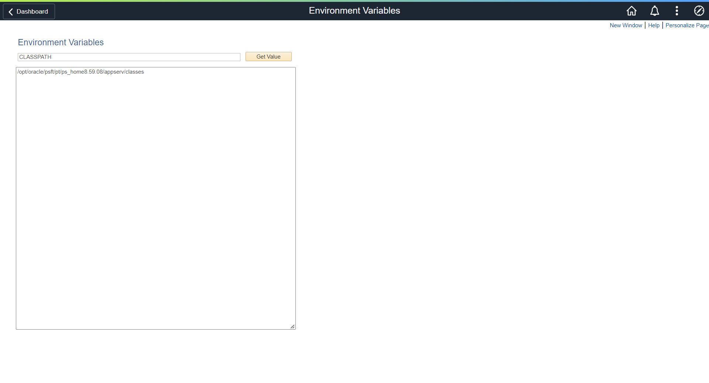

# PeopleSoft Environment Variable
PeopleSoft utility to get environment variables defined within a PeopleSoft server.



## How to Install
### Step 1: Import the custom menu and folder
1. Launch Application Designer 
2. click Tools, Copy Project, From File...   
3. click Select, choose MXM_CUSTOM_INIT
4. click Copy

### Step 2: Import the project
1. Launch Application Designer
2. Click Tools, Copy Project, From File...   
3. Click Select, choose MXM_GETENV
4. Click Copy

### Step 3. Register the component
1. Open the component
2. Click Tools, Register Component...
3. Check off the following:
   - Add this component to a menu
   - Add this component to a portal registry
   - Add this component to a permission list
4. Click Next
5. Select Menu Name: MXM_CUSTOM_MENU and Bar Name: USE
6. Click Next
7. Select Folder Name: MXM_CUSTOM
8. Change Content Reference Label and Long Description fields to the title of the page
9. Check off Always use default local node
10. Click Next
11. Select Permission List Name: PTPT1200
12. Click Next
13. Check off Registry entry under Add to project
14. Click Finish


## Technical Documentation
### App Designer Project: MXM_GETENV

### Records	
Record: MXM_GETENV
| Field | Type | Length | Long Descr | Short Descr |
| ------| --------- | --------- | --------- | --------- |
| INPUTNAME | Char | 30 | Input Name | Input Name |     
| SEARCH | Char | 1 | Search Criteria | Criteria |       
| DESCRLONG | Long | 0 | Description | Descr | 


### PeopleCode

Event: MXM_GETENV.SEARCH.FieldChange

```
MXM_GETENV.DESCRLONG.Value = "";
Local string &env = MXM_GETENV.INPUTNAME.Value;
Local string &envvalue = GetEnv(&env);
MXM_GETENV.DESCRLONG.Value = &envvalue;
```

Event: MXM_GETENV.PageActivate

```
MXM_GETENV.INPUTNAME.HtmlAttributes = "placeholder=""Environment Variable""";
```

### Pages

Page:MXM_GETENV   
Title: List Files   
MXM_GETENV.INPUTNAME    
MXM_GETENV.SEARCH   
MXM_GETENV.DESCRLONG   

### Component

| Component | MXM_GETENV | 
| ------| --------- |
| Page | MXM_GETENV | 
| Navigation | Custom Components > Environment Variables | 
| Item Label | Environment Variables | 
| Search Record | INSTALLATION |
| Add | Selected | 
| Update Display | Selected |
| Disable Saving Page | Selected | 
| Menu | MXM_CUSTOM_MENU |
| Bar item Name | MENUITEM | 
| Portal | Employee |
| Folder Name | MXM_CUSTOM | 
| Content Reference label | Environment Variables |
| Long Description | Environment Variables | 
| Sequence Number | 0 |
| Always Use Local Node | Selected | 
| Permission Lists | PTPT1200 |
| Actions | Add, Update/Display |


## Notes
### Common environment variables
- PS_FILEDIR
- PS_SERVDIR        
- PS_HOME                
- PS_APP_HOME            
- PS_CUST_HOME  
- PS_CFG_HOME 
- CLASSPATH
- PATH


## Feedback:
Please create a GitHub Issue for any bugs, feature requests, etc. Happy to accept pull requests too!


